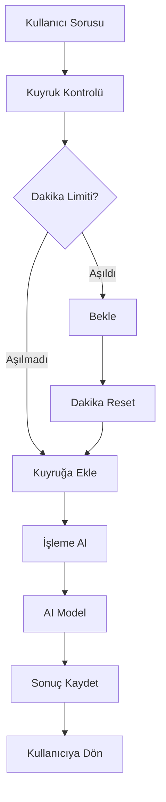

# Soru Kuyruğu Sistemi (Question Queue System)

Bu sistem, gelen soruları kuyruğa alarak dakikada maksimum 15 soru işleyecek şekilde rate limiting sağlar. Bu sayede API limitlerini aşmadan kontrollü bir şekilde sorular yanıtlanır.

## ✨ Özellikler

- 🔄 **Otomatik Kuyruk Yönetimi**: Dakikada 15 soru limiti
- ⏱️ **Tahmini Bekleme Süreleri**: Kullanıcı kuyruktaki pozisyonunu bilir
- 📊 **Gerçek Zamanlı İzleme**: Kuyruk durumu ve istatistikler
- 🎯 **Öncelik Sistemi**: Yüksek öncelikli sorular önde işlenir
- 🔄 **Asenkron İşleme**: Eşzamanlı 3 soru işleme kapasitesi
- 🧹 **Otomatik Temizlik**: Eski sonuçlar otomatik temizlenir

## 🚀 Kullanım

### 1. Soru Gönderme (Kuyruğa Ekle)

```bash
curl -X POST http://localhost:3000/askchat \
  -H "Content-Type: application/json" \
  -d '{
    "message": "İTÜ kütüphanesinde yapay zeka kitapları var mı?",
    "userId": "user123",
    "priority": 1
  }'
```

**Yanıt:**
```json
{
  "success": true,
  "message": "Sorunuz kuyruğa eklendi",
  "processId": "q_1696000000000_abc123def",
  "status": {
    "status": "queued",
    "position": 3,
    "queueSize": 8,
    "enqueuedAt": 1696000000000,
    "estimatedWaitTime": 45000
  },
  "queueStats": {
    "queueSize": 8,
    "position": 3,
    "estimatedWaitTime": 45000
  }
}
```

### 2. Sonuç Alma

```bash
curl http://localhost:3000/askchat/result/q_1696000000000_abc123def
```

**İşleme Alındı:**
```json
{
  "success": true,
  "processId": "q_1696000000000_abc123def",
  "status": "processing",
  "startedAt": 1696000030000,
  "waitTime": 30000
}
```

**Tamamlandı:**
```json
{
  "success": true,
  "processId": "q_1696000000000_abc123def",
  "status": "completed",
  "result": {
    "success": true,
    "response": "İTÜ kütüphanesinde yapay zeka konusunda çeşitli kitaplar bulunmaktadır...",
    "timestamp": "2023-09-29T10:30:00.000Z",
    "conversationId": "conv_123",
    "userId": "user123",
    "executionTime": 2500,
    "toolsUsed": 2,
    "queueProcessed": true
  },
  "processedAt": 1696000035000,
  "processingTime": 2500
}
```

### 3. Anlık İşleme (Kuyruk Bypass)

Acil durumlar için kuyruğu atlayarak direkt işleme:

```bash
curl -X POST http://localhost:3000/askchat/immediate \
  -H "Content-Type: application/json" \
  -d '{
    "message": "Acil durum sorusu",
    "userId": "admin"
  }'
```

## 📊 Monitoring

### Kuyruk İstatistikleri

```bash
curl http://localhost:3000/queue/stats
```

**Yanıt:**
```json
{
  "success": true,
  "stats": {
    "totalQueued": 156,
    "totalProcessed": 134,
    "totalFailed": 2,
    "currentQueueSize": 5,
    "averageProcessingTime": 3200,
    "lastProcessedAt": 1696000035000,
    "processingCount": 2,
    "processedThisMinute": 8,
    "remainingQuotaThisMinute": 7,
    "nextResetIn": 25000,
    "completedCount": 132,
    "failedCount": 2,
    "queueItems": [
      {
        "id": "q_1696000040000_xyz789",
        "enqueuedAt": 1696000040000,
        "priority": 0,
        "waitTime": 5000
      }
    ],
    "processingItems": [
      {
        "id": "q_1696000038000_def456",
        "startedAt": 1696000038000,
        "processingTime": 7000
      }
    ]
  }
}
```

### İşlem Durumu Sorgulama

```bash
curl http://localhost:3000/queue/status/q_1696000000000_abc123def
```

## 🔧 Yönetim

### Kuyruğu Temizle

```bash
curl -X POST http://localhost:3000/queue/clear
```

### Eski Sonuçları Temizle

```bash
curl -X POST http://localhost:3000/queue/cleanup \
  -H "Content-Type: application/json" \
  -d '{"olderThanMinutes": 30}'
```

## ⚙️ Konfigürasyon

```javascript
// helpers/questionQueue.js
const questionQueue = new QuestionQueue({
  maxQuestionsPerMinute: 15,    // Dakikada max soru sayısı
  processInterval: 60000        // Reset aralığı (1 dakika)
});
```

## 🔄 Sistem Davranışı

### Rate Limiting
- **Dakika Başına Limit**: 15 soru
- **Eşzamanlı İşleme**: Maksimum 3 soru
- **Reset Aralığı**: Her dakika sayaç sıfırlanır

### Kuyruk Önceliklendirme
```javascript
// Yüksek öncelikli soru
{
  "message": "Acil soru",
  "priority": 10  // Yüksek sayı = yüksek öncelik
}

// Normal soru
{
  "message": "Normal soru",
  "priority": 0   // Varsayılan
}
```

### Bekleme Süresi Hesaplama
```
estimatedWaitTime = (position - remainingQuota) / maxQuestionsPerMinute * 60000
```

## 📈 Performans

### Tipik Senaryolar

| Durum | Bekleme Süresi | Açıklama |
|-------|----------------|----------|
| Kuyruk boş | ~1 saniye | Anında işlenir |
| 5 soru bekliyor | ~20 saniye | Mevcut dakika içinde |
| 20 soru bekliyor | ~2 dakika | Sonraki dakikaya taşar |
| Peak saatlerde | ~5-10 dakika | Yoğun kullanımda |

### Optimizasyon İpuçları
- Yüksek öncelikli soruları `priority > 0` ile işaretleyin
- Acil durumlar için `/askchat/immediate` kullanın
- Uzun sorular için tahmini süreyi kullanıcıya bildirin

## 🔍 Durum Kodları

| Status | Açıklama |
|--------|----------|
| `queued` | Soru kuyrukta bekliyor |
| `processing` | Soru şu anda işleniyor |
| `completed` | Soru başarıyla tamamlandı |
| `failed` | Soru işlenirken hata oluştu |
| `not_found` | İşlem ID bulunamadı |

## 🚨 Hata Yönetimi

### Yaygın Hatalar

**Kuyruk Dolu:**
```json
{
  "error": "Kuyruk kapasitesi aşıldı, lütfen daha sonra deneyin"
}
```

**İşlem Bulunamadı:**
```json
{
  "success": true,
  "processId": "invalid_id",
  "status": "not_found",
  "error": "İşlem ID bulunamadı"
}
```

**İşleme Hatası:**
```json
{
  "success": true,
  "processId": "q_123",
  "status": "failed",
  "error": "Model yanıt vermedi",
  "failedAt": 1696000040000
}
```

## 📱 Frontend Entegrasyonu

### Polling Örneği (JavaScript)

```javascript
async function askQuestionWithQueue(message, userId) {
  // 1. Soruyu kuyruğa gönder
  const queueResponse = await fetch('/askchat', {
    method: 'POST',
    headers: { 'Content-Type': 'application/json' },
    body: JSON.stringify({ message, userId })
  });
  
  const { processId, status } = await queueResponse.json();
  
  // 2. Sonucu bekle
  return new Promise((resolve, reject) => {
    const checkResult = async () => {
      try {
        const response = await fetch(`/askchat/result/${processId}`);
        const result = await response.json();
        
        if (result.status === 'completed') {
          resolve(result.result);
        } else if (result.status === 'failed') {
          reject(new Error(result.error));
        } else {
          // Hala işleniyor veya bekliyor
          setTimeout(checkResult, 2000); // 2 saniye sonra tekrar kontrol et
        }
      } catch (error) {
        reject(error);
      }
    };
    
    checkResult();
  });
}

// Kullanım
askQuestionWithQueue("Test sorusu", "user123")
  .then(result => console.log("Cevap:", result.response))
  .catch(error => console.error("Hata:", error));
```

### WebSocket Entegrasyonu (Gelecek)

Gerçek zamanlı güncellemeler için WebSocket desteği planlanmaktadır:

```javascript
// Planlanmış özellik
const ws = new WebSocket('ws://localhost:3000/queue/watch');
ws.on('message', (data) => {
  const update = JSON.parse(data);
  if (update.processId === myProcessId) {
    updateUI(update.status);
  }
});
```

## 🔄 Sistem Akışı



Bu sistem sayesinde API limitlerini aşmadan, kontrollü ve öngörülebilir bir şekilde sorular işlenebilir! 🎯
